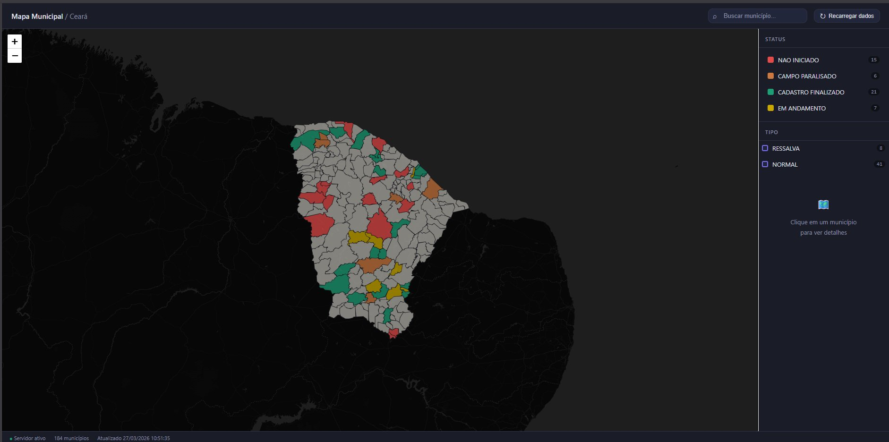

<div align="center">

# 🗺️ Ceará Municipal Map

**A lightweight, local-first territorial dashboard for visualizing all 184 municipalities of Ceará — with real-time status from your own spreadsheet.**

[](https://python.org)
[](https://flask.palletsprojects.com)
[](https://leafletjs.com)
[](https://developer.mozilla.org/en-US/docs/Web/HTML)
[](LICENSE)



</div>

---

## 🇬🇧 English

### What is this?

A **local web application** that renders all 184 municipalities of Ceará (Brazil) on an interactive map, color-coded by operational status — pulled directly from an Excel spreadsheet you already use. Built for teams that need fast, visual decision-making about which municipalities to visit, prioritize, or escalate.

No cloud. No SaaS. No per-seat pricing. Just Python + a browser.

### ✨ Features

- **Interactive choropleth map** of all 184 Ceará municipalities via Leaflet.js
- **Live data from Excel** — reads your open `.xlsx` or `.xlsm` via xlwings, falls back to the saved file via openpyxl automatically
- **Smart cache** — detects file changes via `mtime`, never re-reads unnecessarily
- **Status filter** — click any legend item to isolate municipalities by status
- **Type filter** — secondary filter by a `tipo` column, cumulative with status
- **Municipality search** — accent-insensitive search by name or IBGE code
- **Click-to-detail panel** — shows name, IBGE code, status badge, and type on click
- **One-click reload** — refresh data from the spreadsheet without restarting the server
- **Fully configurable** — all column names, colors, file paths and port set in a single `config.py`
- **Dark UI** — low-fatigue interface designed for extended operational use
- **Lightweight** — ~65 MB RAM total, runs on a 8 GB notebook alongside Excel

### 🏗️ Architecture

```
Excel / .xlsm (OneDrive)
        │
        ▼
  Python Flask server
  ├── xlwings   → reads live data if Excel is open
  ├── openpyxl  → fallback from saved file on disk
  └── mtime cache → only reprocesses when file changes
        │
        ▼ REST API  GET /municipios
        │
  Leaflet.js frontend
  ├── GeoJSON (Ceará, ~11 MB, exported from QGIS)
  ├── Status filter
  ├── Type filter
  └── Municipality search
```

### ⚡ Quick Start

**1. Clone and install**
```bash
git clone https://github.com/nicoryy/ceara-municipal-map.git
cd ceara-municipal-map/backend
pip install -r requirements.txt
```

**2. Add your GeoJSON**

Export the Ceará municipal boundary shapefile from QGIS as GeoJSON and place it at:
```
frontend/municipios_ce.geojson
```
The field `codigo_ibg` (IBGE code) and `Municipio` (name) are expected — other common field names are auto-detected as fallback.

**3. Configure**

Edit `backend/config.py`:
```python
PLANILHA_PATH = r"C:\Users\You\OneDrive\your_spreadsheet.xlsm"
PLANILHA_ABA  = "sheet_name"
COLUNA_CODIGO_IBGE = "codigo_ibge"
COLUNA_STATUS      = "status"
COLUNA_TIPO        = "tipo"

STATUS_CORES = {
    "active":   "#1D9E75",
    "pending":  "#EF9F27",
    "blocked":  "#E24B4A",
}
```

**4. Run**
```bash
python server.py
# Open: http://localhost:5000
```

### 📋 Spreadsheet format

Your sheet must have at least:

| codigo_ibge | status | tipo |
|---|---|---|
| 2304400 | active | NORMAL |
| 2301000 | pending | RESSALVA |

Column names are configurable. IBGE codes are zero-padded automatically.

### 🔌 API Endpoints

| Method | Endpoint | Description |
|---|---|---|
| `GET` | `/municipios` | Returns all municipalities with status and color |
| `POST` | `/reload` | Forces spreadsheet re-read |
| `GET` | `/status` | Cache metadata |

### 🗂️ Project Structure

```
ceara-municipal-map/
├── backend/
│   ├── config.py           ← edit this first
│   ├── server.py           ← Flask API
│   ├── planilha_reader.py  ← xlwings + openpyxl reader
│   └── requirements.txt
├── frontend/
│   ├── index.html          ← full UI (single file)
│   └── municipios_ce.geojson  ← add yours here (not included)
├── data/
│   └── cache_dados.json    ← auto-generated
└── README.md
```

### 🔧 Requirements

- Python 3.10+
- Excel (for xlwings live reading — optional, openpyxl works without it)
- A GeoJSON of Ceará municipalities (exportable from QGIS via IBGE shapefiles)
- A spreadsheet with `codigo_ibge` and `status` columns

---

## 🇧🇷 Português

### O que é isso?

Uma **aplicação web local** que renderiza todos os 184 municípios do Ceará em um mapa interativo, colorido por status operacional — lido diretamente de uma planilha Excel que você já usa. Desenvolvida para equipes que precisam tomar decisões rápidas e visuais sobre quais municípios visitar, priorizar ou escalar.

Sem nuvem. Sem SaaS. Sem cobrança por usuário. Só Python + um navegador.

### ✨ Funcionalidades

- **Mapa coroplético interativo** dos 184 municípios do Ceará via Leaflet.js
- **Dados ao vivo do Excel** — lê o arquivo `.xlsx` ou `.xlsm` aberto via xlwings, com fallback automático para o arquivo salvo via openpyxl
- **Cache inteligente** — detecta mudanças no arquivo via `mtime`, sem releituras desnecessárias
- **Filtro por status** — clique em um item da legenda para isolar municípios por status
- **Filtro por tipo** — filtro secundário pela coluna `tipo`, cumulativo com o status
- **Busca de município** — busca sem acento por nome ou código IBGE
- **Painel de detalhes** — exibe nome, código IBGE, badge de status e tipo ao clicar
- **Reload com um clique** — atualiza dados da planilha sem reiniciar o servidor
- **Totalmente configurável** — nomes de colunas, cores, caminhos e porta definidos em um único `config.py`
- **Interface escura** — baixa fadiga visual para uso operacional prolongado
- **Leve** — ~65 MB de RAM total, roda em notebook de 8 GB junto com o Excel aberto

### ⚡ Como rodar

**1. Clone e instale**
```bash
git clone https://github.com/nicoryy/ceara-municipal-map.git
cd ceara-municipal-map/backend
pip install -r requirements.txt
```

**2. Adicione seu GeoJSON**

Exporte a malha municipal do Ceará do QGIS como GeoJSON e coloque em:
```
frontend/municipios_ce.geojson
```

**3. Configure**

Edite `backend/config.py`:
```python
PLANILHA_PATH = r"C:\Users\Voce\OneDrive\sua_planilha.xlsm"
PLANILHA_ABA  = "nome_da_aba"
COLUNA_CODIGO_IBGE = "codigo_ibge"
COLUNA_STATUS      = "status"
COLUNA_TIPO        = "tipo"

STATUS_CORES = {
    "ativo":      "#1D9E75",
    "pendente":   "#EF9F27",
    "bloqueado":  "#E24B4A",
}
```

**4. Execute**
```bash
python server.py
# Acesse: http://localhost:5000
```

### 📋 Formato da planilha

A aba configurada deve ter ao menos:

| codigo_ibge | status | tipo |
|---|---|---|
| 2304400 | ativo | NORMAL |
| 2301000 | pendente | RESSALVA |

Os nomes das colunas são configuráveis. Zeros à esquerda no código IBGE são corrigidos automaticamente.

### 📌 Observações

- O arquivo GeoJSON **não está incluído** no repositório por ser um dado governamental volumoso. Exporte pelo QGIS a partir da malha municipal do IBGE/IPECE.
- O xlwings só é usado se o Excel **já estiver com o arquivo aberto** — nunca abre o arquivo em background.
- Se o Excel estiver fechado ou o arquivo bloqueado pelo OneDrive, o openpyxl lê o último save em disco automaticamente.

### 📄 Licença

MIT — use, modifique e distribua à vontade.

---

<div align="center">

Made in Fortaleza, CE 🌵 by [Nicory](https://github.com/nicoryy)

</div>
