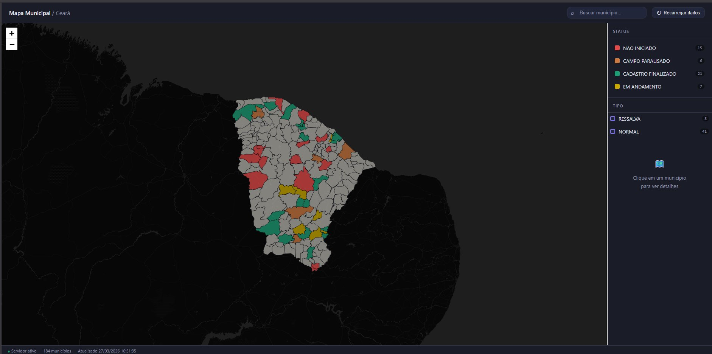

<div align="center">

# 🗺️ Ceará Municipal Map

**A lightweight, local-first territorial dashboard for visualizing all 184 municipalities of Ceará — with live data pulled from local spreadsheets.**

[](https://python.org)
[](https://flask.palletsprojects.com)
[](https://leafletjs.com)
[](https://developer.mozilla.org/en-US/docs/Web/HTML)
[](LICENSE)



</div>

---

## 🎥 Demo

> **Espaço reservado para vídeo do funcionamento do projeto.**
>
> _Adicione aqui um vídeo curto demonstrando: navegação pelo mapa, filtros cumulativos, busca por município, troca entre camadas geográficas, painel de detalhes e leitura ao vivo dos dados da planilha._

<!--
Para inserir o vídeo:
- Faça upload de um GIF ou MP4 na pasta `public/`
- Substitua este bloco por: 
- Ou use a sintaxe HTML <video> apontando para o arquivo
-->

---

## 🇬🇧 English

### What is this?

A **local web application** that renders all 184 municipalities of Ceará (Brazil) on an interactive map and overlays multiple layers of operational data — pulled directly from spreadsheets you already use. Built for teams that need fast, visual decision-making over multi-dimensional territorial information, without leaving the desktop.

No cloud. No SaaS. No per-seat pricing. Just Python + a browser.

### ✨ Features

- **Interactive choropleth map** of all 184 Ceará municipalities via Leaflet.js
- **Live spreadsheet integration** — reads open `.xlsx` / `.xlsm` files via xlwings, with automatic openpyxl fallback when the file is closed
- **Multi-source overlay** — multiple categories of data displayed on the same map, organized by year and type
- **Map layer switcher** — switch between street, light, dark and satellite (hybrid) base maps
- **Special administrative regions** — Fortaleza is broken into its 12 regionals, each colored by its own status
- **Smart caching** — detects file changes via `mtime`, avoids unnecessary reads
- **Cumulative filters** — combine status and type filters; both apply to all overlays
- **Accent-insensitive search** — find municipalities by name or IBGE code
- **Detail panel** — click any feature for name, status, type and metadata
- **Point-level inspection** — open detailed survey markers per municipality with year/type routing
- **Inaccessible area polygons** — render KML/spreadsheet-driven polygons of restricted zones
- **Transformer overlays** — group point markers by source file with sidebar selection
- **Export** — save filtered subsets for sharing
- **One-click reload** — refresh all sources without restarting the server
- **Dark UI** — low-fatigue interface for extended operational use
- **Lightweight** — runs comfortably alongside Excel on a typical work notebook

### 🏗️ Architecture

```
Local spreadsheets (.xlsx / .xlsm)
        │
        ▼
  Python Flask backend
  ├── xlwings   → live read while the file is open
  ├── openpyxl  → fallback from saved file on disk
  └── mtime cache → only reprocesses on change
        │
        ▼ REST API
        │
  Leaflet.js frontend
  ├── GeoJSON (municipal boundaries)
  ├── GeoJSON (Fortaleza administrative regions)
  ├── KML overlays (point datasets)
  ├── Filters (status, type, year)
  ├── Map layer switcher
  └── Search + detail panel
```

### 🔧 Requirements

- Python 3.10+
- Excel (optional — only required for live reading via xlwings; openpyxl handles the closed-file case)
- A modern browser

---

## 🇧🇷 Português

### O que é isso?

Uma **aplicação web local** que renderiza os 184 municípios do Ceará em um mapa interativo e sobrepõe múltiplas camadas de dados operacionais — lidos diretamente de planilhas que você já usa. Desenvolvida para equipes que precisam tomar decisões rápidas e visuais sobre informações territoriais multi-dimensionais, sem sair do desktop.

Sem nuvem. Sem SaaS. Sem cobrança por usuário. Só Python + um navegador.

### ✨ Funcionalidades

- **Mapa coroplético interativo** dos 184 municípios do Ceará via Leaflet.js
- **Integração ao vivo com planilhas** — lê arquivos `.xlsx` / `.xlsm` abertos via xlwings, com fallback automático para openpyxl quando o arquivo está fechado
- **Sobreposição multi-fonte** — várias categorias de dados exibidas no mesmo mapa, organizadas por ano e tipo
- **Troca de camadas de mapa** — alterna entre fundo de ruas, claro, escuro e satélite (híbrido)
- **Regiões administrativas especiais** — Fortaleza dividida em suas 12 regionais, cada uma com cor própria de acordo com seu status
- **Cache inteligente** — detecta mudanças via `mtime`, sem releituras desnecessárias
- **Filtros cumulativos** — combine filtro de status e tipo; ambos aplicam a todas as camadas
- **Busca sem acentos** — encontre municípios por nome ou código IBGE
- **Painel de detalhes** — clique em qualquer elemento para nome, status, tipo e metadados
- **Inspeção em nível de ponto** — abre marcadores detalhados de levantamento por município, com roteamento por ano/tipo
- **Polígonos de áreas inacessíveis** — renderiza zonas restritas a partir de KML/planilha
- **Sobreposição de transformadores** — agrupa marcadores por arquivo de origem com sidebar de seleção
- **Exportação** — salva subconjuntos filtrados para compartilhamento
- **Reload em um clique** — atualiza todas as fontes sem reiniciar o servidor
- **Interface escura** — baixa fadiga visual para uso operacional prolongado
- **Leve** — roda confortavelmente junto com o Excel em um notebook típico de trabalho

### 🏗️ Arquitetura

```
Planilhas locais (.xlsx / .xlsm)
        │
        ▼
  Backend Python (Flask)
  ├── xlwings   → leitura ao vivo enquanto o arquivo está aberto
  ├── openpyxl  → fallback do arquivo salvo em disco
  └── cache mtime → só reprocessa quando o arquivo muda
        │
        ▼ API REST
        │
  Frontend Leaflet.js
  ├── GeoJSON (limites municipais)
  ├── GeoJSON (regiões administrativas de Fortaleza)
  ├── Sobreposições KML (pontos)
  ├── Filtros (status, tipo, ano)
  ├── Troca de camada de mapa
  └── Busca + painel de detalhes
```

### 🔧 Requisitos

- Python 3.10+
- Excel (opcional — necessário apenas para leitura ao vivo via xlwings; o openpyxl cobre o caso de arquivo fechado)
- Um navegador moderno

### 📄 Licença

MIT — use, modifique e distribua à vontade.

---

<div align="center">

Made in Fortaleza, CE 🌵 by [Nicory](https://github.com/nicoryy)

</div>
